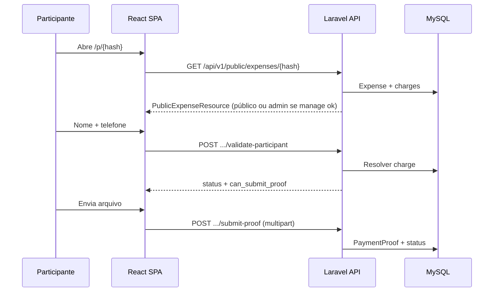

# Arquitetura

## Visão em camadas

```
Browser (React SPA em public/spa)
        │  HTTPS
        ▼
Laravel (PHP-FPM) — rotas web: SPA shell; rotas /api/*: JSON
        │
        ├── MySQL (dados)
        ├── Redis (opcional; fila/cache conforme .env)
        └── storage/app (comprovantes)
```

## Backend: Laravel 12 API

- **Prefixo:** `routes/api.php` → URI base `/api` + grupos `v1`.
- **Resposta padrão de domínio:** `App\Http\Responses\ApiResponse` (`success`, `message`, `data`, `meta` / erros com `code`).
- **Exceção HTTP:** `HttpApiException` mapeada em `bootstrap/app.php` para o envelope.
- **Auth:** Laravel Sanctum **Bearer token** (sem cookie SPA stateful neste projeto).
- **Fluxo público:** identificação por `public_hash` na URL; poder de gestão por `manage_token` (query `manage` ou header `X-Manage-Token`), comparado com `hash_equals`.
- **Controllers** delegam para **Actions** (ex.: `ValidateChargeAction`) e **Services** (ex.: `ExpenseService`, `PaymentProofService`).
- **Form Requests** centralizam validação; **Resources** formatam JSON.
- **Middleware:** throttle global API + limitadores nomeados; `SecurityHeaders` (HSTS em produção HTTPS, `nosniff`, frame deny, etc.).

### Padrão Controller → Action → Service → Resource

- **Consistente** na maior parte dos fluxos de despesa/cobrança e público.
- **Exceção intencional:** `AuthController` devolve JSON “cru” (`user` + `token` / `message`) para compatibilidade com o client React; o frontend já trata esse formato em `authLogin` / `authRegister`.

## Frontend: React + Vite + TypeScript

- **Código:** `frontend/`; **build:** `npm run build` → artefatos em `public/spa/` com `manifest: true`.
- **Router:** React Router v6; rotas públicas (`/p/:hash`) vs. autenticadas (`/dashboard`, etc.).
- **Estado remoto:** TanStack Query disponível (`App.tsx`), mas grande parte das telas usa `useState` + `api` imperativo.
- **API:** `frontend/src/lib/api/client.ts` — `VITE_API_BASE_URL` definido → chamadas reais; ausente → `mockStore` (localStorage) para demo offline.

## Banco de dados

- **Produção/dev:** MySQL 8 (`utf8mb4` / `utf8mb4_unicode_ci`).
- **Testes PHPUnit:** SQLite `:memory:` via `phpunit.xml` (sem exigir MySQL na CI).

## Decisões arquiteturais relevantes

| Decisão | Motivo |
|---------|--------|
| SPA servida pelo mesmo host em produção | Mesma origem reduz complexidade CORS; assets em `/spa/assets/*`. |
| `manage_token` na query | Compartilhamento simples do link de gestão; risco mitigado por não colocar em link de participante e por rate limit. |
| Token Sanctum em `localStorage` | Simplicidade; mitigação principal é anti-XSS e CSP futura. |
| Upload validado por magic bytes no backend | Não confiar em MIME do cliente. |

## Diagrama lógico (fluxo público)


